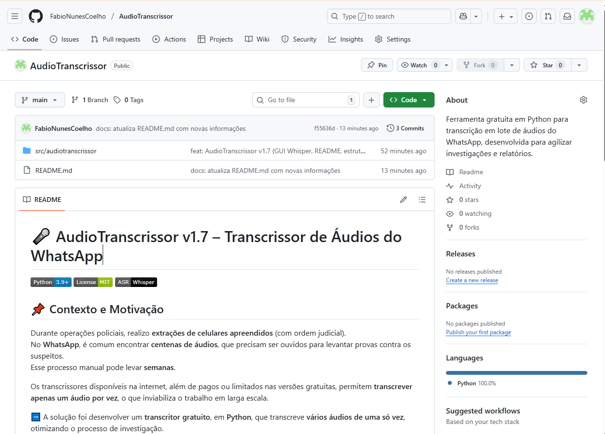
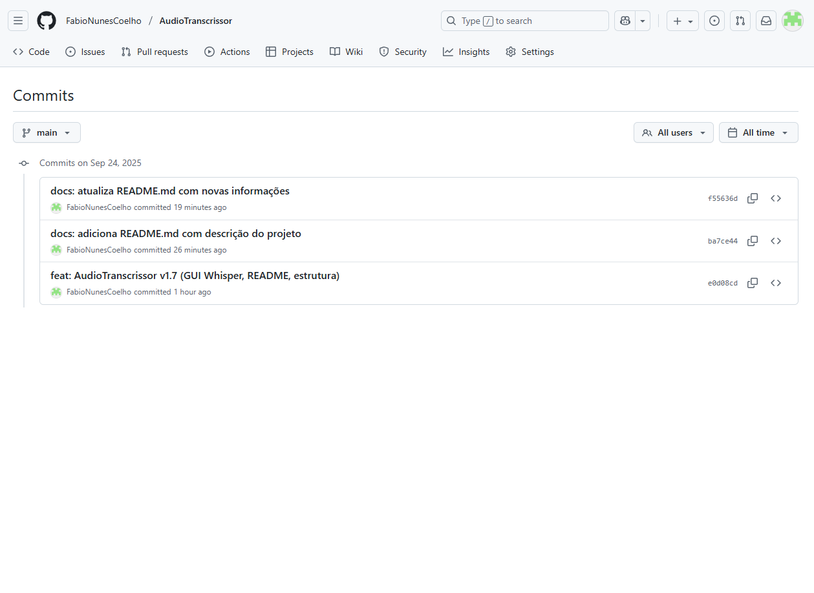
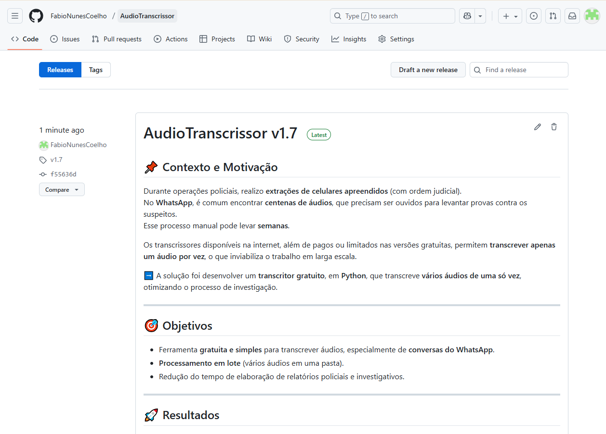
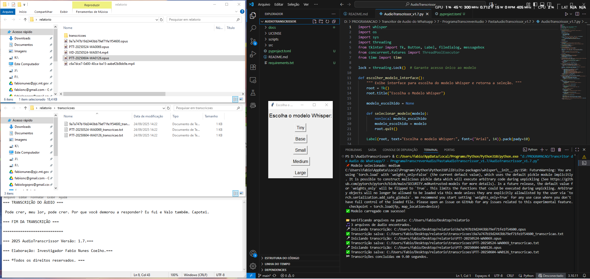

# 🎤 AudioTranscrissor v1.7 – Transcrissor de Áudios do WhatsApp

[]()
[]()
[]()

## 📌 Contexto e Motivação
Durante operações policiais, realizo **extrações de celulares apreendidos** (com ordem judicial).  
No **WhatsApp**, é comum encontrar **centenas de áudios**, que precisam ser ouvidos para levantar provas contra os suspeitos.  
Esse processo manual pode levar **semanas**.

Os transcrissores disponíveis na internet, além de pagos ou limitados nas versões gratuitas, permitem **transcrever apenas um áudio por vez**, o que inviabiliza o trabalho em larga escala.

➡️ A solução foi desenvolver um **transcritor gratuito**, em **Python**, que transcreve **vários áudios de uma só vez**, otimizando o processo de investigação.

---

## 🎯 Objetivos
- Ferramenta **gratuita e simples** para transcrever áudios, especialmente de **conversas do WhatsApp**.  
- **Processamento em lote** (vários áudios em uma pasta).  
- Redução do tempo de elaboração de relatórios policiais e investigativos.  

---

## 🚀 Resultados
- Transcrição de **pastas inteiras** de uma só vez.  
- Redução de tempo em **até 2/3** vs. processo manual.  
- Mantém a necessidade de **validação/revisão**, ainda assim **acelera consideravelmente**.

---

## ⚙️ Funcionalidades
- Interface gráfica (Tkinter) para escolher **modelo Whisper** e **pasta com áudios**.  
- Suporte a `.ogg`, `.mp3`, `.wav`, `.m4a`, `.aac`, `.flac`, `.opus`.  
- Criação automática da pasta `transcricoes/` com `.txt`.  
- Cabeçalho/rodapé com **versão** e **autoria**.  

---

## 🛠️ Tecnologias
- Python 3.9+
- OpenAI Whisper
- PyTorch
- Tkinter (nativo)
- **ffmpeg** (no sistema)

---

## 📦 Instalação

> Windows (VS Code recomendado)

1. **Python 3.12.8** (marque “Add python.exe to PATH”):  
   https://www.python.org/ftp/python/3.12.8/python-3.12.8-amd64.exe

2. **FFmpeg**  
   - Baixe build completa: https://www.gyan.dev/ffmpeg/builds/ffmpeg-git-full.7z  
   - Extraia, renomeie a pasta para `C:\ffmpeg`  
   - No **CMD (Admin)**:
     ```
     setx /m PATH "C:\ffmpeg\bin;%PATH%"
     ```
   - Feche e reabra o terminal, teste com `ffmpeg`.

3. **Clonar & instalar deps**
   ```bash
   git clone https://github.com/<SEU_USUARIO>/AudioTranscrissor.git
   cd AudioTranscrissor
   python -m venv .venv
   .venv\Scripts\activate
   pip install -r requirements.txt

## 📸 Evidências Visuais

### Página inicial do repositório


### Histórico de commits


### Release publicada


### Execução da ferramenta

